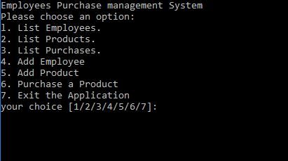

# Employees Purchase management System [EPMS]
A C++ program that manages employees, products and their purchases and save them into csv files.

## How to use it
- It's an interactive shell application that gives the user multiple choics.
- As shown in the example it works using command line
> run it

- You can get use a binary file built on windows10 at [bin](bin/epms.exe) directory.
- You can get the source code and build it using any C compiler at [src](src/epms.cpp) directory.

###### Have any question or request .. 
Contact ME: Ahmad Hegazy <ahegazipro@gmail.com>
